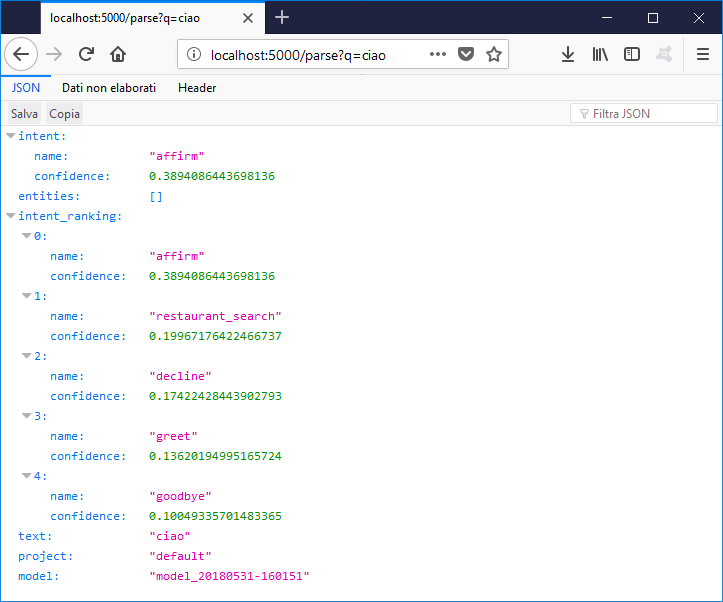

# UniversityInternship

## Day 1 [02/05/18] : 5,5 ore
* Spiegazione architettura software
* Individato un percorso indicativo da seguire: AngularJS, Spring, ChatBot
* Inizio studio di AngularJS sul libro: AngularJS Up & Running Book for O'Reilly (vedi repository: [AngularJs](https://github.com/Wabri/angularJS-Up-And-Running))
* Arrivato fino al capitolo 2 del libro (vedi repository: [AngularJs](https://github.com/Wabri/angularJS-Up-And-Running))

## Day 2 [03/05/18] : 6,5 ore
* Continuato lo studio di AngularJS fino al capitolo 3 (vedi repository: [AngularJs](https://github.com/Wabri/angularJS-Up-And-Running))
* Varie prove di unit test usando Jasmine per l'implementazione dei test e Karma per il running

## Day 3 [08/05/18] : 6,5 ore
* Continuato lo studio di AngularJS fino a capitolo 4 (vedi repository: [AngularJs](https://github.com/Wabri/angularJS-Up-And-Running))
* Studio del vecchio progetto chatBot su macchina remota
* Vari test su dialogflow per la generazione di file di configurazione JSON dell'intelligenza artificiale
* Analisi di un chatbot base (vedi repository: [girliemac/web-speech-ai](https://github.com/girliemac/web-speech-ai))

## Day 4 [09/05/18] : 7 ore
* Creazione di un chatbot locale (vedi repository: [BVChatBot](https://github.com/Wabri/BVChatBot)) 
* Creazione di un prototipo di inteligenza artificiale per pagamenti usando [dialogflow](https://dialogflow.com)
* Tentativo di comprensione del vecchio prototipo (risultato: riesce solo a eseguire un singolo test e a generare un json con le diverse valute europee)

## Day 5 [10/05/18] : 4 ore
* Continuato la stesura del codice del chatbot (vedi repository: [BVChatBot](https://github.com/Wabri/BVChatBot))
* Studio degli strumenti usati nella chat: [SpeechRecognition](https://developer.mozilla.org/en-US/docs/Web/API/SpeechRecognition), [Socket.io](https://socket.io/) , [API.AI](https://github.com/dialogflow/dialogflow-nodejs-client-v2)

## Day 6 [16/05/18] : 7,5 ore
* Continuato lo studio di AngularJS fino al capitolo 6 (vedi: [AngularJSRepo](https://github.com/Wabri/angularJS-Up-And-Running)) 
* Continuato lo studio degli strumenti usati nella chat: [SpeechRecognition](https://developer.mozilla.org/en-US/docs/Web/API/SpeechRecognition), [Socket.io](https://socket.io/) , [API.AI](https://github.com/dialogflow/dialogflow-nodejs-client-v2)

## Day 7 [17/05/18] : 5,5 ore
* Integrazione di una chat testuale al chatbot (vedi repository: [BVChatBot](https://github.com/Wabri/BVChatBot))

## Day 8 [22/05/18] : 6,5 ore
* Studio della documentazione dello strumento open source [rasa](https://rasa.com/) che permette di usare strumenti di machine learning. Dovrebbe sostituire dialogflow permettendo di trattenere dati sensibili all'interno del server dedicato al software sviluppato evitando l'intermediario google.
* Creazione di alcuni esempi per l'utilizzo di [rasa](https://rasa.com/) (vedi repository: [LearningRasaNLU](https://github.com/Wabri/LearningRasaNLU/))
* Installazione componenti necessari per sviluppo [rasa](https://rasa.com/) su sistema operativo windows: python, pip, [spacy](https://spacy.io/), rasa_nlu, rasa_core

## Day 9 [23/05/18] : 6,5 ore
* Studio di Rasa NLU nei docs della pagina ufficiale [rasa](https://rasa.com/)
* Studio dell'architettura MVC con servizi Rest e [spring boot](https://spring.io/guides)
* Studio di un esempio spring e vari test usando swagger (vedi directory:  [exampleSpringRest](exampleSpringRest/BV-SERVICES-TEST))

## Day 10 [24/05/18] : 6,5 ore
* Ricerca di un esempio di chat [exampleJavascriptFrontend](exampleJavascriptFrontend/front)
* Tentativi di esecuzione di una comunicazione locale tra back-end [exampleSpringRest](exampleSpringRest/BV-SERVICES-TEST) e front-end [exampleJavascriptFrontend](exampleJavascriptFrontend/front)
* Problemi con la comunicazione spring boot e grunt, la richiesta inviata tramite front-end non veniva accettata dal back-end in localhost quindi è stato necessario inserire una configurazione globale che potesse consentire lo scambio di dati, vedi [configurazione qui](https://github.com/Wabri/UniversityInternship/blob/9f6834eef8cebb01c19f8a1ecb02c40055c31d40/exampleSpringRest/BV-SERVICES-TEST/src/main/java/ch/bestvision/serv/config/WebConfig.java#L11)

## Day 11 [29/05/18] : 5,5 ore
* Revisione del codice [exampleJavascriptFrontend](exampleJavascriptFrontend/front) per integrare il codice della chat precedentemente creata [BVChatBot](https://github.com/Wabri/BVChatBot)
* Il codice [exampleJavascriptFrontend](exampleJavascriptFrontend/front) ha dato problemi quindi mi sono concentrato sulla modifica del [BVChatBot](https://github.com/Wabri/BVChatBot) per fare in modo che esegua una chiamata rest generica per una comunicazione base con [exampleSpringRest](exampleSpringRest/BV-SERVICES-TEST)

## Day 12 [30/05/18] : 6 ore
* Continuato la stesura e l'aggiornamento del [BVChatBot](https://github.com/Wabri/BVChatBot)
* Ho completato il cerchio di comunicazione tra il chatbot, dialogflow e backend (ancora nella fase base [exampleSpringRest](exampleSpringRest/BV-SERVICES-TEST))

## Day 13 [31/05/18] : 6 ore (forse)
* Risolto un bug nel codice [BVChatBot](https://github.com/Wabri/BVChatBot) e successivo miglioramento del codice, il risultato attualmente è: 
* Pubblicato il bot su [heroku](https://www.heroku.com/) all'indirizzo: [https://trainingchatbotbv.herokuapp.com/](https://trainingchatbotbv.herokuapp.com/). in questo modo posso fare training su più dispositivi (per ora funziona solo su chrome)
* Studiato un modo per utilizzare [rasa_nlu](https://nlu.rasa.com/) per processare i messaggi del bot (vedi repository: [LearningRasaNLU](https://github.com/Wabri/LearningRasaNLU))
* Creato un esempio di modello di training per l'intelligenza artificiale della chat, creato un server locale e eseguita una semplice chiamata 

## Day 14 [12/06/18] : 7,5 ore
* Vari tentativi di connessione di [rasa_nlu](https://nlu.rasa.com/) con emulazione configurazione Dialogflow.
* Nella repository [LearningRasaNLU](https://github.com/Wabri/LearningRasaNLU) sono riuscito a creare un modello a partire da file di configurazione di [dialogflow](https://dialogflow.com), all'interno di quella repository ho scritto anche degli appunti riassuntivi del processo di emulazione rasa dialogflow

## Day 15 [13/06/18] : 
* Ripreso il lavoro di ieri, usando i dati di training fatto con dialogflow in precedenza ho completato il modello e finito i [primi appunti sull'uso di rasa](https://github.com/Wabri/LearningRasaNLU/tree/newExampleAndNotes/notes)
* Ho testato il funzionamento del backend rasa con dati dialogflow con un semplice testo "paga mario 100 euro":

